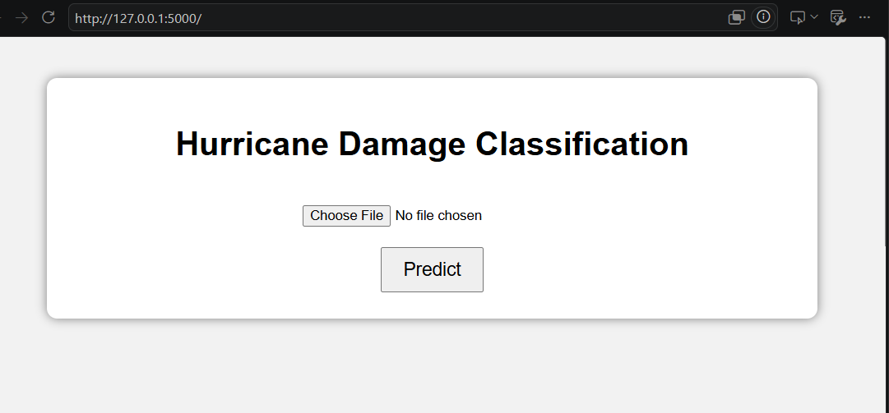
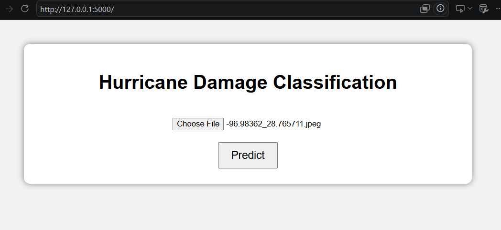
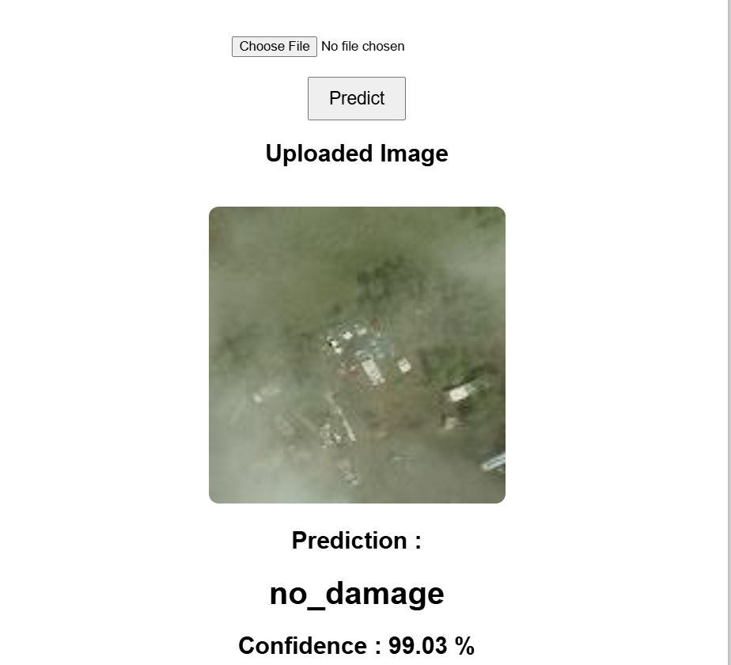
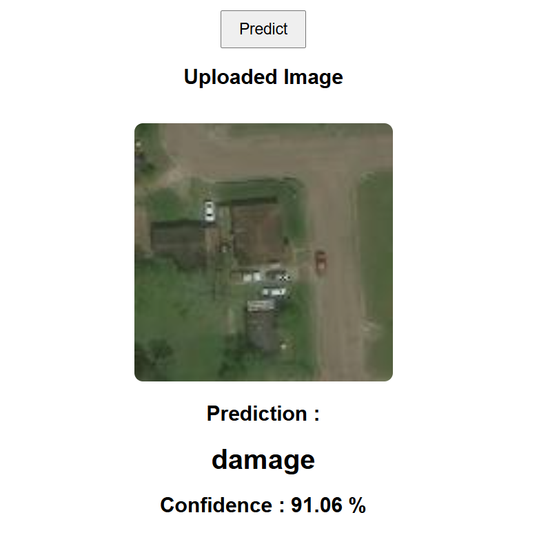

# 🌪️ Hurricane Damage Classification using CNN

A deep-learning web application that classifies hurricane-related images into two categories: **Damage** and **No Damage**.

The project uses a Convolutional Neural Network (CNN) trained with TensorFlow/Keras and integrates the trained model into a Flask web application for real-time image classification.

---

## 1. Project Overview

Hurricane Damage Classification is an image classification system designed to identify whether a hurricane-related image shows **damage** or **no damage**.

The trained CNN model processes an uploaded image and predicts its class along with a confidence score. The model is deployed through a Flask web application, allowing users to interact with the trained model through a simple browser-based interface.

### Problem Solved

After a hurricane or other natural disaster, large numbers of images may need to be reviewed to determine whether visible damage is present. Manual inspection can be time-consuming.

This project demonstrates how deep learning and computer vision can be used to automate the initial classification of hurricane images into **damage** and **no damage** categories.

---

## 2. Features

- Upload hurricane-related images through a web interface.
- Classify images into:
  - `damage`
  - `no_damage`
- Use a trained CNN model for image classification.
- Automatically preprocess uploaded images.
- Resize images to `64 × 64` pixels before prediction.
- Display the uploaded image.
- Display the predicted class.
- Display the model's confidence score.
- Secure uploaded filenames using Werkzeug.
- Automatically create the upload directory when required.
- Run the trained model locally through a Flask application.

---

## 3. Tech Stack

| Technology | Role |
|---|---|
| **Python** | Main programming language for model development and deployment |
| **TensorFlow** | Deep-learning framework used to load and run the CNN model |
| **Keras** | Used to build, train, save, and load the CNN model |
| **CNN** | Learns visual patterns from hurricane images for binary classification |
| **NumPy** | Converts images into numerical arrays for model input |
| **Pillow** | Opens, converts, resizes, and preprocesses images |
| **Flask** | Backend framework used to deploy the trained model as a web application |
| **Werkzeug** | Provides secure filename handling for uploaded files |
| **HTML/CSS** | Provides the user interface |
| **Jupyter Notebook** | Used for dataset exploration, model training, and evaluation |
| **VS Code** | Used for Flask application development and deployment |
| **Git/GitHub** | Used for version control and project hosting |

---

## 4. Architecture

The application follows a simple machine-learning inference architecture:

```text
                    ┌─────────────────────┐
                    │        USER         │
                    │                     │
                    │   Uploads Image     │
                    └──────────┬──────────┘
                               │
                               ▼
                    ┌─────────────────────┐
                    │      Flask App      │
                    │       app.py        │
                    └──────────┬──────────┘
                               │
                               ▼
                    ┌─────────────────────┐
                    │ Image Preprocessing │
                    │                     │
                    │ RGB Conversion      │
                    │ Resize 64 × 64      │
                    │ Normalize /255      │
                    └──────────┬──────────┘
                               │
                               ▼
             ┌──────────────────────────────────┐
             │       Trained CNN Model          │
             │                                  │
             │ hurricane_damage_model.keras     │
             └─────────────────┬────────────────┘
                               │
                               ▼
                    ┌─────────────────────┐
                    │     Prediction      │
                    │                     │
                    │ Damage / No Damage  │
                    │ Confidence Score    │
                    └──────────┬──────────┘
                               │
                               ▼
                    ┌─────────────────────┐
                    │    Web Interface    │
                    │     index.html      │
                    └─────────────────────┘

**Prediction Flow**

Image Upload
     ↓
Secure Filename
     ↓
Save Image
     ↓
RGB Conversion
     ↓
Resize to 64 × 64
     ↓
Normalize Pixel Values
     ↓
CNN Model
     ↓
Prediction Probability
     ↓
Damage / No Damage
     ↓
Confidence Score
     ↓
Display Result

---

```
# 5. Project Structure
```


Hurricane_Project/
│
├── app.py
├── hurricane_damage_model.keras
├── requirements.txt
├── README.md
│
├── docs/
│   ├── home-page-1.png
│   ├── home-page-2.png
│   ├── damage-prediction.png
│   └── no-damage-prediction.png
│
├── templates/
│   └── index.html
│
└── static/
    └── uploads/
Important Files

app.py

Main Flask application responsible for:

Loading the trained CNN model
Receiving uploaded images
Preprocessing images
Running predictions
Calculating confidence
Sending results to the HTML interface

hurricane_damage_model.keras

The trained TensorFlow/Keras CNN model used for hurricane damage classification.

requirements.txt

Contains the Python dependencies required to run the Flask application.

templates/index.html

Provides the web interface for image upload and displaying prediction results.

static/uploads/

Stores images uploaded through the Flask application.

docs/

Contains screenshots used in this README to demonstrate the application.


```
# 6. Installation and Setup

```


Prerequisites

Make sure the following are installed:

Python 3.10 or later
pip
Git
VS Code

Clone the Repository

git clone <https://github.com/asiyasajeed30-glitch/Hurricane_Project>

cd Hurricane_Project

Create a Virtual Environment

On Windows:

python -m venv venv
Activate the Virtual Environment

PowerShell:

venv\Scripts\activate
Install Dependencies
pip install -r requirements.txt

The main dependencies include:

Flask
TensorFlow
Keras
NumPy
Pillow
Werkzeug
Model Setup

Make sure the trained model is located in the project root:

Hurricane_Project/
│
├── app.py
├── hurricane_damage_model.keras
└── ...

The model filename must be:

hurricane_damage_model.keras

because it is loaded in app.py using:

model = tf.keras.models.load_model("hurricane_damage_model.keras")
Environment Variables

The current version does not require environment variables or API keys.

Database

The current application does not use a database.

Uploaded images are stored locally in:

static/uploads/


 ```
 # 7. Usage

 ```

Start the Flask application:

python app.py

The application will run locally at:

http://127.0.0.1:5000

**How to Use**

Open the application in a web browser.
Click Choose File.
Select a hurricane-related image.
Click Predict.
The image is uploaded and preprocessed.
The CNN model generates a prediction.
The application displays the predicted class and confidence score.
Possible Predictions
damage

or

no_damage

Example:

Prediction: damage


Confidence: 96.42%


 ```
 # 8. Screenshots / Demo

 


The following screenshots show the actual Flask application and prediction results.

### Application Home Page



### Image Upload Interface



### Damage Prediction



### No Damage Prediction




**Application Flow**


Upload Image
      ↓
Click Predict
      ↓
Image Preprocessing
      ↓
CNN Prediction
      ↓
Damage / No Damage
      ↓
Confidence Score


**Live Demo**

The application currently runs locally using Flask.

http://127.0.0.1:5000

A public deployment can be added in a future version.


 ```
 # 9. API Documentation

 ```


The current application does not expose a separate REST API.

However, Flask provides the main application route for image upload and prediction.

Main Endpoint
/
HTTP Methods
GET
POST
GET Request

A GET request displays the image-upload interface.

POST Request

A POST request submits an image for classification.

Request Parameter

The uploaded image is received through:

image

The request uses:

multipart/form-data
Authentication

Authentication is not implemented in the current version.

Response

The application renders the HTML page containing:

Uploaded image
Predicted class
Confidence score

Example:

Prediction: damage
Confidence: 96.42%


```

# # 10. Engineering Decisions
```


CNN for Image Classification

A Convolutional Neural Network was selected because the project works with image data.

CNNs are capable of learning visual patterns such as:

Edges
Textures
Shapes
Spatial features

These features help the model distinguish between hurricane-damaged and non-damaged images.

Binary Classification

The project contains two classes:

damage
no_damage

The model uses a single sigmoid output for binary classification.

A probability threshold of 0.5 is used to determine the predicted class.

Image Preprocessing

Uploaded images are converted to RGB and resized to 64 × 64 pixels before being passed to the model.

Pixel values are normalized from:

0 – 255

to:

0 – 1

using:

img = img / 255.0

This ensures that the input format during deployment matches the format used during model training.

.keras Model Format

The trained model is stored as:

hurricane_damage_model.keras

The Keras model format is used because the project is based on TensorFlow/Keras.

pickle or joblib is not required for saving this CNN model because the trained neural network is already stored in the Keras model format.

Flask for Deployment

Flask was selected because it provides a lightweight way to connect the trained CNN model with a browser-based interface.

The application does not require a complex backend because its main workflow is:

Upload Image
      ↓
Preprocess Image
      ↓
CNN Inference
      ↓
Display Prediction

Local File Storage

Uploaded images are currently stored in:

static/uploads/

This keeps the application simple and avoids the need for a database or external storage service.

Security

Uploaded filenames are processed using Werkzeug's:

secure_filename()

This prevents unsafe filenames from being directly used when saving uploaded files.


```
# 11. Testing

```


Model Evaluation

The trained CNN model was evaluated using a separate test dataset.

The evaluation included:

Accuracy Score
Confusion Matrix
Classification Report

Example evaluation:

```

**from sklearn.metrics import accuracy_score
from sklearn.metrics import confusion_matrix
from sklearn.metrics import classification_report


prediction = model.predict(X_test)


prediction = (prediction > 0.5).astype(int)


prediction = prediction.flatten()


print("Accuracy:")
print(accuracy_score(y_test, prediction))


print("Confusion Matrix:")
print(confusion_matrix(y_test, prediction))


print("Classification Report:")
print(classification_report(y_test, prediction))
```
**

**Flask Application Testing**

The deployed application was tested by:

Starting the Flask server.
Opening the application in a browser.
Selecting test images.
Uploading images from both classes.
Checking the uploaded image preview.
Checking the predicted class.
Checking the confidence score.
Test Cases
Test Case	Expected Result
Open application	Upload interface is displayed
Select valid image	Image is accepted
Upload damage image	Damage prediction is generated
Upload no-damage image	No-damage prediction is generated
Submit image	Prediction is displayed
Uploaded image	Image preview is displayed
Start application	CNN model loads successfully


---


# 12. Limitations


The model performs binary classification only.
The available classes are limited to damage and no_damage.
Prediction accuracy depends on the quality and diversity of the training dataset.
Images that are significantly different from the training data may be incorrectly classified.
The model performs image-level classification and does not identify the exact location of damage.
Damage detection and object localization are not implemented.
Uploaded images are stored locally.
Prediction history is not stored in a database.
User authentication is not implemented.
The current application uses Flask's development server.
The confidence score represents the model's prediction probability and should not be interpreted as guaranteed certainty.


```
# 13. Future Improvements

```

Possible improvements include:

Use transfer learning with architectures such as MobileNet, ResNet, or EfficientNet.
Improve model performance through additional training data and augmentation.
Implement damage localization using object detection or image segmentation.
Add prediction history using a database.
Add user authentication.
Store uploaded images using cloud storage.
Deploy the application to a public cloud platform.
Add automated unit and integration testing.
Use a production WSGI server for deployment.
Improve the user interface and make it responsive for mobile devices.


```
# 14. End-to-End Workflow

```
                  HURRICANE IMAGE DATASET
                           │
                           ▼
                  Data Preprocessing
                           │
                           ▼
                      CNN Training
                           │
                           ▼
                   Model Evaluation
                           │
                           ▼
             hurricane_damage_model.keras
                           │
                           ▼
                     Flask Backend
                           │
                           ▼
                     Image Upload
                           │
                           ▼
                  Image Preprocessing
                           │
                           ▼
                     CNN Inference
                           │
                           ▼
                ┌──────────┴──────────┐
                │                     │
             Damage               No Damage
                │                     │
                └──────────┬──────────┘
                           │
                           ▼
                   Confidence Score
                           │
                           ▼
                    Web Interface


```
# 15. Conclusion

```

This project demonstrates an end-to-end deep-learning workflow for hurricane image classification, from CNN model development and evaluation to Flask-based deployment.

The application allows users to upload hurricane-related images and receive an automated classification of:

Damage or No Damage

along with a confidence score through a simple web interface.

```
# Author

```

Asiya S

B.Tech Computer Science & Engineering

```
# Technologies

```
Python TensorFlow Keras CNN Flask NumPy Pillow HTML CSS Git GitHub

**License**

This project is developed for educational and demonstration purposes.


